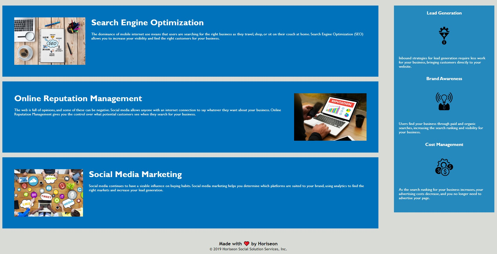

# # Code Refactor 

## Description

The purpose of this project is to modify the base code so it meets accesibility standars and to use semantic tags in order to help the web browser engine and to improve its efficiency. 

## Website Screenshot

## Installation
 
No installation needed. 

## Usage 

This web application meet basic standars and is not optimized whatsoever. The purpose is for the student to analize the HTML and CSS codes and modify without breaking the website and to improve its performance/accesibility. 

## Credits

N/A
